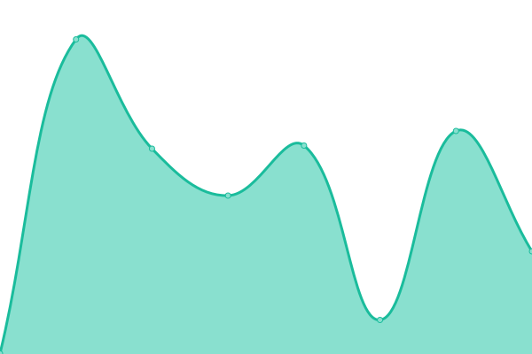

# [📈 Live Status](https://upptime.github.io/upptime): <!--live status--> **🟧 Partial outage**

This repository contains the open-source uptime monitor and status page for [Melon](https://botmelon.vercel.app), powered by [Upptime](https://github.com/upptime/upptime) & [cState](https://github.com/cstate/cstate).

<!--start: status pages-->
<!-- This summary is generated by Upptime (https://github.com/upptime/upptime) -->
<!-- Do not edit this manually, your changes will be overwritten -->
<!-- prettier-ignore -->
| URL | Status | History | Response Time | Uptime |
| --- | ------ | ------- | ------------- | ------ |
|  [Website](https://melonbot.io) | 🟩 Up | [website.yml](https://github.com/japandotorg/Melon-Status/commits/HEAD/history/website.yml) | 

 118ms
     
 | 

<a href="https://status.melonbot.io/history/website">100.00%</a>
    

|  [Documentation Website](https://guide.melonbot.io) | 🟩 Up | [documentation-website.yml](https://github.com/japandotorg/Melon-Status/commits/HEAD/history/documentation-website.yml) | 

 244ms
     
 | 

<a href="https://status.melonbot.io/history/documentation-website">100.00%</a>
    

|  [Japandotorg](https://japandotorg.me) | 🟥 Down | [japandotorg.yml](https://github.com/japandotorg/Melon-Status/commits/HEAD/history/japandotorg.yml) | 

 0ms
     
 | 

<a href="https://status.melonbot.io/history/japandotorg">100.00%</a>
    

<!--end: status pages-->

[**Visit our status website →**](https://upptime.github.io/upptime)

## 📄 License

- Powered by: [Upptime](https://github.com/upptime/upptime) & [cState](https://github.com/cstate/cstate)
- Code: [MIT](./LICENSE) © [japandotorg](https://japandotorg.me)
- Data in the `./history` directory: [Open Database License](https://opendatacommons.org/licenses/odbl/1-0/)
